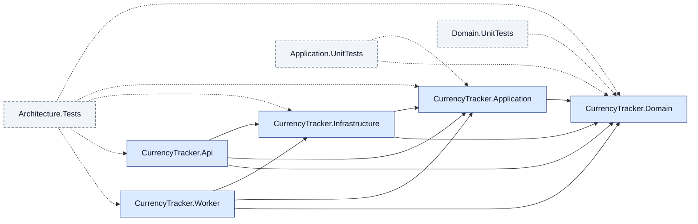

# currency-tracker

A learning-by-doing currency tracker built solo with AI agents.
Clean Architecture, .NET 10 LTS, Wolverine, Aspire, Postgres, Redis.

## Current phase

**Phase 0 — Minimal repo bootstrap.** No production code yet. The build plan
runs through Phase 16 (optional React frontend). Deploy is Phase 14; ignore
anything deploy-related until then.

## Running locally

There is nothing to run yet. Phase 7 introduces the Aspire AppHost, after
which `dotnet run --project src/CurrencyTracker.AppHost` will bring up the
full local stack (API, Worker, Postgres, Redis, Keycloak, OTLP collector).

### The Aspire dashboard

After `dotnet run --project src/CurrencyTracker.AppHost` (lands in 7.10),
the AppHost prints a dashboard URL to stdout (a randomly-assigned local
port). Open it in a browser.

The **Resources** tab shows the running resources once everything is
healthy: `postgres` (with the `currencytracker` database as a
sub-resource), `cache`, `api`, and `worker`. Each row shows the
resource's status, its endpoints, and a link to its logs.

The **Traces** tab shows OpenTelemetry traces in real time. Hitting
`GET /ping` on the Api produces a trace with service name `api`; later
phases (8–13) will populate this tab with the real business-flow
traces.

The **Logs** tab streams structured logs from each resource. The
Aspire dashboard has no authentication in Development and is not
exposed beyond `localhost`; Phase 14's Azure deployment uses
Application Insights instead.

## Architecture

CurrencyTracker follows the Clean Architecture dependency direction:
`Domain ? Application ? Infrastructure ? (Api | Worker)`. Domain has zero
outbound references; each layer depends only on the layers below it.
Architecture tests under `tests/CurrencyTracker.Architecture.Tests`
fail the build when the contract is violated.

## Project documents

- `AGENTS.md` — conventions, "Don't" list, gotchas. **Read this if you are
  an agent session, before doing anything else.**
- `docs/decisions/` — architecture decision records.

## Licence

Apache License 2.0 (see `LICENSE`).
