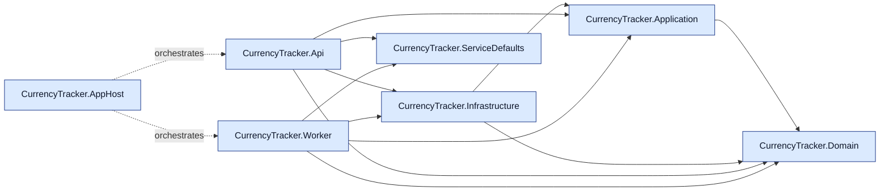

# currency-tracker

A learning-by-doing currency tracker built solo with AI agents.
Clean Architecture, .NET 10 LTS, Wolverine, Aspire, Postgres, Redis.


## Current phase

**Phase 12 — Worker + scheduled ingestion + alerts + outbox.** The API is
live and authenticated (auth landed in Phase 11). Phase 12 turns the Worker
from a no-op host into a durable, scheduled message host: Part 1 adds the
daily scheduled ingestion on a Postgres outbox/inbox; Part 2 adds the
`ingest → evaluate → dispatch` alert cascade. The build plan runs through
Phase 16 (optional React frontend). Deploy is Phase 14; ignore anything
deploy-related until then.

## Running locally

Phase 7 lands the Aspire AppHost. From a clean clone, one command
brings up the entire local stack (Api, Worker, Postgres, Redis, and
the Aspire dashboard):

```bash
dotnet run --project src/CurrencyTracker.AppHost
```

## How to test

```powershell
dotnet test -c Release
```

Runs the whole suite: Domain/Application/Infrastructure/Worker/ServiceDefaults
unit tests, the Architecture tests (which fail the build on a dependency-
direction violation), and the Testcontainers-backed integration tests
(Postgres + Redis are pulled automatically — Docker must be running).
CI collects coverage on this run and fails the build if it drops below the
configured floor (see `.github/workflows/ci.yml`).

Prerequisites:

- .NET 10 SDK (10.0.300 or newer — see `global.json`).
- A Docker-compatible container runtime: Docker Desktop, OrbStack
  (macOS), or Docker Engine (Linux). Aspire pulls the Postgres and
  Redis images on first run; subsequent runs reuse the cached images
  and the named data volumes (`currencytracker-pgdata`,
  `currencytracker-redisdata`) so any seeded data survives an AppHost
  restart.

To wipe local data and start clean:

```bash
docker volume rm currencytracker-pgdata currencytracker-redisdata
```

The Worker runs the daily rate-ingestion job on a schedule (Quartz cron,
06:00 UTC by default) and publishes through a Postgres-backed Wolverine
outbox; you can watch a run in the dashboard's Traces tab. Set
`Worker:IngestSchedule` to `*/30 * * * * ?` to see it fire every 30s.

### The Aspire dashboard

After `dotnet run --project src/CurrencyTracker.AppHost`, the AppHost
prints a dashboard URL to stdout (a randomly-assigned local port).
Open it in a browser.

The **Resources** tab shows the running resources once everything is
healthy: `postgres` (with `currencytracker` as a sub-resource),
`cache`, `api`, and `worker`. The **Traces** tab shows OpenTelemetry
traces in real time — hit `GET /ping` on the Api and the trace
appears within a second. The **Logs** tab streams structured logs
from each resource. The dashboard has no authentication and is not
exposed beyond `localhost`; Phase 14's Azure deployment uses
Application Insights instead.

## Development environment

```bash
dotnet --version            # 10.0.300 or newer
csharpier --version         # global tool, used by every PR
gh auth status              # authenticated
docker info                 # container runtime running
```

## Architecture

CurrencyTracker follows the Clean Architecture dependency direction:
`Domain ? Application ? Infrastructure ? (Api | Worker)`. Domain has zero
outbound references; each layer depends only on the layers below it.
Architecture tests under `tests/CurrencyTracker.Architecture.Tests`
fail the build when the contract is violated.



## How to add a currency

Currencies flow from the Frankfurter provider (Phase 9) through ingestion
into Postgres and the read model. To track a new one:

1. Confirm the provider returns it (Frankfurter supports the ECB set).
2. Add/confirm the currency code in the Domain currency set
   (`src/CurrencyTracker.Domain`) so the value object accepts it.
3. If the ingestion slice filters codes, add it there
   (`src/CurrencyTracker.Application` ingestion handler).
4. Run the Worker's ingestion once (`Worker:IngestSchedule` to `*/30 * * * * ?`
   for a fast local run) and confirm the rate lands via
   `GET /api/v1/rates/latest`.
5. Add a test asserting the new code round-trips through ingestion.

No schema change is needed — rates are stored by code, not column.

## Project documents

- `AGENTS.md` — conventions, "Don't" list, gotchas. **Read this if you are
  an agent session, before doing anything else.**
- `docs/decisions/` — architecture decision records.

## Licence

Apache License 2.0 (see `LICENSE`).
