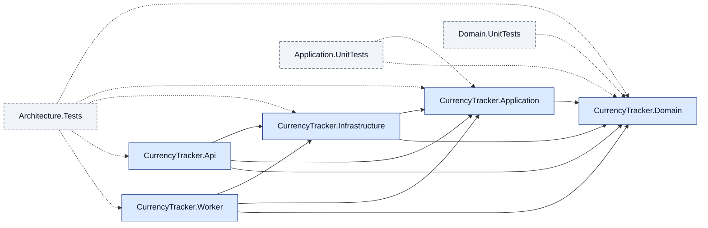

# currency-tracker

A learning-by-doing currency tracker built solo with AI agents.
Clean Architecture, .NET 10 LTS, Wolverine, Aspire, Postgres, Redis.

## Current phase

**Phase 0 — Minimal repo bootstrap.** No production code yet. The build plan
runs through Phase 16 (optional React frontend). Deploy is Phase 14; ignore
anything deploy-related until then.

## Running locally

Phase 7 lands the Aspire AppHost. From a clean clone, one command
brings up the entire local stack (Api, Worker, Postgres, Redis, and
the Aspire dashboard):

```bash
dotnet run --project src/CurrencyTracker.AppHost
```

Prerequisites:

- .NET 10 SDK (10.0.300 or newer — see `global.json`).
- A Docker-compatible container runtime: Docker Desktop, OrbStack
  (macOS), or Docker Engine (Linux). Aspire pulls the Postgres and
  Redis images on first run; subsequent runs reuse the cached images
  and the named data volumes (`currencytracker-pgdata`,
  `currencytracker-redisdata`) so any seeded data survives an AppHost
  restart.

To wipe local data and start clean:

```bash
docker volume rm currencytracker-pgdata currencytracker-redisdata
```

The Worker process starts but has no jobs to run yet — Phase 12 adds
the scheduled rate-ingestion job. For now the Worker is a healthy
no-op visible in the dashboard.

### The Aspire dashboard

After `dotnet run --project src/CurrencyTracker.AppHost`, the AppHost
prints a dashboard URL to stdout (a randomly-assigned local port).
Open it in a browser.

The **Resources** tab shows the running resources once everything is
healthy: `postgres` (with `currencytracker` as a sub-resource),
`cache`, `api`, and `worker`. The **Traces** tab shows OpenTelemetry
traces in real time — hit `GET /ping` on the Api and the trace
appears within a second. The **Logs** tab streams structured logs
from each resource. The dashboard has no authentication and is not
exposed beyond `localhost`; Phase 14's Azure deployment uses
Application Insights instead.

## Development environment

```bash
dotnet --version            # 10.0.300 or newer
csharpier --version         # global tool, used by every PR
gh auth status              # authenticated
docker info                 # container runtime running
```

## Architecture

CurrencyTracker follows the Clean Architecture dependency direction:
`Domain ? Application ? Infrastructure ? (Api | Worker)`. Domain has zero
outbound references; each layer depends only on the layers below it.
Architecture tests under `tests/CurrencyTracker.Architecture.Tests`
fail the build when the contract is violated.



## Project documents

- `AGENTS.md` — conventions, "Don't" list, gotchas. **Read this if you are
  an agent session, before doing anything else.**
- `docs/decisions/` — architecture decision records.

## Licence

Apache License 2.0 (see `LICENSE`).
