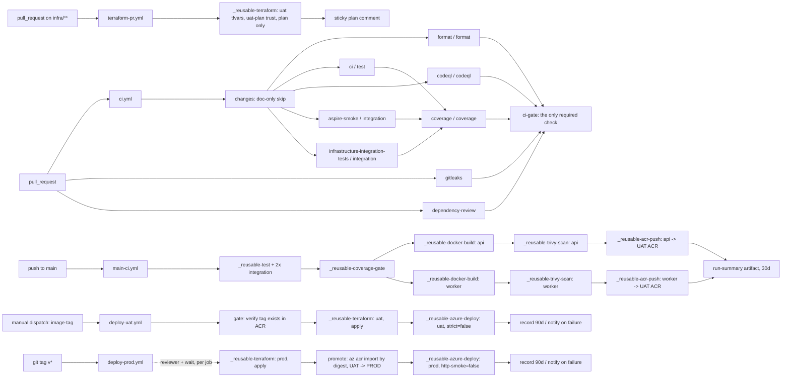

# CI/CD pipelines

The workflow graph, what blocks what, and the seams a later phase flips.

Everything here is derived from the files in [`.github/workflows/`](../../.github/workflows/)
and from the branch-protection API — not from the build plan's illustrative
version. Where the two disagree, the drift is recorded in [§Recorded drifts](#recorded-drifts).

---

## The graph



The dotted edge into PROD is the `prod` GitHub Environment gate. It is three
gates in one keyword: it pauses for the required reviewer and wait timer, it
mints an OIDC token whose subject is `repo:…:environment:prod` — the only
subject `gh-deploy-prod`'s federated credential trusts — and it resolves
`vars.AZURE_*` from the prod scope. Trust, approval, and configuration select
together or not at all, so UAT credentials cannot be aimed at PROD by accident:
outside their environment, they do not exist.

The same keyword is why `terraform-pr.yml` targets **`uat-plan`** and not `uat`.
`uat`'s deployment-branch policy allows `main` only, so the PR plan job was
refused before it started — a 2-second failure with no logs, on every infra PR
since the workflow landed. `_reusable-terraform.yml` now derives the GitHub
Environment from `inputs.apply`: an apply gets `<env>`, a plan gets `<env>-plan`.
Callers still pass one `environment`, and backend, tfvars, trust and vars still
select as a unit — `apply` only chooses which unit. `uat-plan` has no protection
rules and its own federated credential (`docs/azure/bootstrap.md` §Federated
credentials); a plan-only call for an environment with no `<env>-plan` fails
closed at login rather than falling back to the gated one. Nothing that applies
or deploys may reference it.

---

## Gates — what blocks what

Required checks on `main` (**source of truth: the branch-protection API**; this
list is a copy — refresh with the command below when it changes):

```powershell
gh api repos/mpcs2013/currency-tracker/branches/main/protection/required_status_checks --jq ".contexts"
```

`ci-gate` · `gitleaks` · `dependency-review`

**One aggregate check, not six named ones.** The list used to name each job
directly — `ci / test`, `coverage / coverage`, `format / format`,
`codeql / codeql`, `aspire-smoke / integration`,
`infrastructure-integration-tests / integration` — and that could not survive the
`changes` filter. When a job calls a reusable workflow, GitHub reports the check
under the composite `caller / callee` name and the bare name stops existing;
when that same job is **skipped**, the composite never appears and the check is
reported under the bare `ci` instead. Branch protection matches by exact string,
so whichever spelling is required, the other case reports nothing — and a
required check that nothing reports does not fail, it **waits forever** with
"Expected — waiting for status".

That is exactly what an infra-only or doc-only PR does: `changes` emits
`code=false`, all six .NET jobs skip on purpose, none of the six required
composite names is ever reported, and the PR cannot be merged by anyone but an
admin. PR #388 (`infra/**` only) is where it surfaced.

`ci-gate` is the fix: a plain job — not a reusable caller, so no composite name —
with `if: always()` and `needs:` on every other job in `ci.yml`. It reports under
one name on every run, and fails only if something upstream **failed or was
cancelled**; `skipped` is a pass, because skipping is the intended outcome of the
filter. Adding, renaming or removing a job in `ci.yml` now means editing that
`needs:` list, and never touching branch protection.

- **PRs** are gated by `ci.yml` (the list above), plus `terraform-pr.yml` on
  `infra/**` changes — which is **advisory**, not required. Required-check
  semantics and path-filtered workflows do not compose: a workflow that does not
  trigger reports no check, and a required check that never reports blocks the
  PR. So the IaC gate's enforcement is social — the plan comment sitting in
  every infra review. Decision recorded 14.40.
- **`main-ci.yml` blocks nothing.** It runs post-merge, so wiring any of its jobs
  into branch protection would either never report on PRs (blocking everything)
  or force it to also run on PRs, duplicating `ci.yml` and dissolving the
  release-candidate boundary. The build plan's conditional — "add the new
  required check *if* any of its jobs should block" — resolves to **none**, on
  the record. `main-ci` failing means `main` has no release candidate for its
  head commit: nothing regressed anywhere (the last good artifact is still
  deployed), and the response is roll-forward.
- **Deploys gate themselves.** `deploy-uat` requires a human dispatch and
  verifies the artifact exists before touching Azure; `deploy-prod` sits behind
  the `prod` environment's reviewer, wait timer, and `main`+`v*` branch policy.

## Failure playbook

| Red where       | Blocks                    | Response                                                                    |
| --------------- | ------------------------- | --------------------------------------------------------------------------- |
| `ci.yml` (PR)   | the PR                    | fix the branch                                                              |
| `terraform-pr`  | nothing (advisory)        | fix before merge anyway — the apply that hits this plan is `deploy-uat`'s    |
| `main-ci`       | UAT deploy of that commit | roll forward on `main`; no environment regressed                            |
| `deploy-uat`    | UAT convergence           | re-dispatch after diagnosis; UAT still serves the previous revision         |
| `deploy-prod`   | the release               | fix, re-tag; PROD still serves the previous revision                        |

---

## Leaf workflows

| Workflow           | Trigger                                            | Purpose                                                                                              |
| ------------------ | -------------------------------------------------- | ---------------------------------------------------------------------------------------------------- |
| `ci.yml`           | `pull_request`, `push` to `main`, dispatch         | PR gate: format, test+coverage, CodeQL, the two isolated integration suites, gitleaks, dependency-review |
| `terraform-pr.yml` | `pull_request` on `infra/**`                       | Full IaC gate (UAT, plan only) + sticky plan comment                                                 |
| `main-ci.yml`      | `push` to `main` (not `**.md` / `docs/**`)         | Certify the merge commit; build, Trivy-gate, and push `api:<sha>` / `worker:<sha>` to the UAT ACR    |
| `deploy-uat.yml`   | `workflow_dispatch` (image-tag)                    | Verify the artifact, apply UAT, deploy that SHA, smoke                                                |
| `deploy-prod.yml`  | `push` tags `v*`                                   | Behind the `prod` gate: apply PROD, promote by digest from the UAT ACR, deploy, control-plane verdict |
| `claude.yml`       | issue / review comments containing `@claude`       | Agent assist; unrelated to the delivery path                                                         |

`ci.yml` still carries `push: branches: [main]`. Both it and `main-ci.yml` then
run on a merge, and they overlap on test + coverage. Dropping that trigger is a
deliberate follow-up rather than part of this change, so that trunk is never
left with no CI during the transition — there is a `NOTE` at the top of `ci.yml`
saying so.

## Reusable workflows

| Workflow                          | Does                                                                                                     | Inputs                                                     |
| --------------------------------- | -------------------------------------------------------------------------------------------------------- | ---------------------------------------------------------- |
| `_reusable-format.yml`            | CSharpier + `dotnet format` verification                                                                 | —                                                          |
| `_reusable-test.yml`              | restore + build + every test project **except** the two container suites; emits raw Cobertura            | `configuration`, `os`                                      |
| `_reusable-integration-tests.yml` | one container-heavy suite per runner, in isolation; emits raw Cobertura                                  | `project`, `coverage-artifact`, `configuration`, `os`      |
| `_reusable-coverage-gate.yml`     | merges every `coverage-raw-*` artifact, then applies the measured floor                                  | `coverage-min` (default `58`)                              |
| `_reusable-codeql.yml`            | CodeQL C#, build-mode none (caller grants `security-events: write`)                                      | —                                                          |
| `_reusable-docker-build.yml`      | buildx, `type=gha` cache, exports an image tarball (never pushes: scan-before-push)                      | `context`, `dockerfile`, `image-name`, `tag`               |
| `_reusable-trivy-scan.yml`        | CVE gate on the tarball; HIGH/CRITICAL, fixed-only; `.trivyignore` allowlist                             | `image-name`                                               |
| `_reusable-acr-push.yml`          | OIDC → `az acr login` → push; outputs the digest                                                         | `image-name`, `tag`, `environment`                         |
| `_reusable-terraform.yml`         | fmt/init/validate/tflint/checkov/plan[/apply] over `ARM_*` OIDC                                          | `working-dir`, `environment`, `apply`                      |
| `_reusable-azure-deploy.yml`      | `az containerapp update --image` both apps → revision-health poll → smoke; strictness ladder             | `environment`, `image-tag`, `strict`, `http-smoke`         |

### Why the test work is split three ways

`_reusable-test.yml` runs every project it discovers under `tests/` except
`AppHost.SmokeTests` and `Infrastructure.IntegrationTests`, which
`_reusable-integration-tests.yml` runs one per runner. Those two start
Testcontainers, and running them alongside every other assembly on a single
runner made Docker's random host-port assignment race
(`failed to listen on TCP socket: address already in use`). One suite per runner
removes the contention.

Because coverage is then produced by three jobs, the floor cannot live inside
any of them — each sees only part of the picture and would under-report. Hence
`_reusable-coverage-gate.yml`, which downloads every `coverage-raw-*` artifact,
merges them with ReportGenerator, and applies the floor once. Producers just
have to name their artifact `coverage-raw-*`; a future test job joins the gate
by following the convention.

Discovery in `_reusable-test.yml` is **exclusion-based on purpose**. An
include-list would silently drop a newly added test project — the same failure
mode as the pre-14.28 `has_csharp` gate, whose `compgen -G "**/*.csproj"` never
matched (bash does not recurse `**` without `shopt -s globstar`) and left `ci`
reporting green while running nothing for hundreds of PRs. The loop sets
`globstar` for exactly that reason.

---

## The image treaty

One `docker build` per merge, tagged with the commit SHA, exported as a tarball
artifact so Trivy scans **exactly** what will be pushed, and pushed to the UAT
ACR only after the gate passes. The `needs:` chain in `main-ci.yml` is the
security control, not a convenience: collapsing docker + trivy + push into one
job to "skip the tar" deletes the scan-before-push property.

PROD never builds. A `v*` tag resolves the SHA-tagged image's **digest** in the
UAT ACR and `az acr import`s it into the PROD ACR, so the artifact that soaked in
UAT is byte-identical to the one PROD runs. Promotion is a copy verified by
content address, not by tag trust — see ADR
[0015](../decisions/0015-deploy-topology.md).

The pipeline owns the image; Terraform owns the infrastructure. The apps'
`lifecycle { ignore_changes = [image] }` blocks are the other half of that
treaty — without them, the next `terraform apply` would revert every deploy to
the bootstrap placeholder.

---

## Smoke

Three legs against the Api FQDN, **UAT only** — PROD's environment is
internal-LB and unreachable from hosted runners, so its verdict is revision
health (ADR 0015), which is why `deploy-prod` passes `http-smoke: false`.

1. `GET /health/live` — dependency-free by the 13.B tag contract.
2. `GET /health/ready` — the dependency probe. Expected to fail until 14.E.
3. `GET /api/v1/rates/latest?base=USD&target=EUR` with a bearer token — dormant
   until `SMOKE_TOKEN_RESOURCE` exists (14.E).

The third leg asserts the **payload**, not the status code: a 200 with an empty
body is a load balancer, not a service, and behind a healthy gateway this path
can return an error page or a redirect-to-login rendered as 200 by a helpful
proxy. The assertion is deliberately shallow — the JSON names the requested pair
— because smoke proves service, not correctness. The Alba integration suite owns
correctness; a smoke that re-implements it is a second test suite with worse
tooling.

Verdicts follow the strictness ladder below.

## Seams — flipped by 14.E, in the change that makes passing possible

The Api fail-fasts at boot without its connection strings and authority (Phase
8/11 discipline), so the first real deploys **cannot** be healthy. Pretending
otherwise would either fake the gate or block the phase. The gate machinery
lands now; its teeth arrive with the config.

| Flag                    | Where                                  | Value now | Meaning                                                                        |
| ----------------------- | -------------------------------------- | --------- | ------------------------------------------------------------------------------ |
| `strict`                | deploy leaf → `_reusable-azure-deploy` | `false`   | health gate + smoke warn instead of fail                                        |
| `health_probes_enabled` | root `main.tf` → app modules           | `false`   | platform probes off (readiness cannot pass without config)                     |
| `SMOKE_TOKEN_RESOURCE`  | env-scoped variable                    | unset     | authenticated smoke leg dormant                                                |

A **warned** run is a successful run under this ladder. That distinction matters
for `notify`, which fires on `failure()` — a red job in `needs` — and therefore
does not fire on a warnings-only deploy. Do not "improve" it to `!success()`,
which also matches cancelled and skipped chains.

---

## Manual prerequisites

These are not in the repository and must exist before the workflows that use
them can succeed. Record values in [`docs/azure/bootstrap.md`](../azure/bootstrap.md).

| What                                              | Where                    | Needed by                | Status |
| ------------------------------------------------- | ------------------------ | ------------------------ | ------ |
| `AZURE_CLIENT_ID` / `TENANT_ID` / `SUBSCRIPTION_ID` / `AZURE_RESOURCE_GROUP` | `uat` + `prod` env vars  | every Azure-touching job | 14.6   |
| `PROMOTION_SOURCE_ACR_NAME` / `PROMOTION_SOURCE_ACR_ID` | `prod` env vars    | `deploy-prod` promote    | **pending** |
| `promotion_pull_principal_id` in `envs/uat/terraform.tfvars` | Terraform    | `deploy-prod` promote    | **pending** |
| `SLACK_WEBHOOK_URL`                               | repo-level **secret**    | `notify` (both leaves)   | optional |
| `NOTIFICATIONS_ENABLED`                           | repo-level **variable**  | `notify` kill-switch     | optional |
| `SMOKE_TOKEN_RESOURCE`                            | `uat` env var            | smoke leg 3              | 14.E   |

The promotion pair:

```powershell
$acr = az acr list -g rg-currencytracker-uat --query "[0]" | ConvertFrom-Json
gh variable set PROMOTION_SOURCE_ACR_NAME --env prod --body $acr.name
gh variable set PROMOTION_SOURCE_ACR_ID   --env prod --body $acr.id

# The SERVICE PRINCIPAL's object id — not the app registration's. The classic
# Entra mix-up surfaces much later, as a 403 on the import.
az ad sp list --display-name gh-deploy-prod --query "[0].id" -o tsv
```

`SLACK_WEBHOOK_URL` is **repo-level**, a recorded drift from 14.6's env-scoped
suggestion: an environment-scoped secret would force the `notify` job to declare
`environment: prod`, parking the message that tells you PROD broke behind a
reviewer approval and a wait timer. A notification target is not
environment-differentiated data.

---

## Recorded drifts

Where this implementation departs from the Phase 14.D plan, and why.

| # | Plan said | Implemented | Why |
| - | --------- | ----------- | --- |
| 14.36 | `deploy-uat` chains off `main-ci` via `workflow_run` — every merge auto-deploys UAT | **`workflow_dispatch` only** | Project owner's requirement: no merge may deploy to UAT on its own. Azure is touched when a human asks. Re-enabling is a five-line change: restore the `workflow_run` trigger and the `conclusion == 'success'` guard in `gate`. |
| 14.28/14.35 | `_reusable-build.yml` as a build gate, called by `ci.yml` and `main-ci.yml` | **deleted** | Its restore + `dotnet build -c Release` is byte-identical to `_reusable-test.yml`'s first three steps, and the images compile from source in their own Dockerfiles. After the de-duplication it had zero callers; an uncalled reusable is the anti-pattern the library rule exists to prevent. |
| 14.28 | `_reusable-test.yml` runs the whole solution and owns the coverage floor | **split three ways** | Container suites raced on Testcontainers ports when run alongside everything else; the floor moved to `_reusable-coverage-gate.yml` because no single job now sees all the coverage. |
| 14.40 | Required list includes `build / build` | **`coverage / coverage`** | Follows from the two rows above. Swapped in the branch-protection API in the same change. |
| 14.40 | Required list names each job individually | **one `ci-gate` aggregate** | Naming jobs directly cannot survive the `changes` filter: a skipped reusable caller reports its bare name and never the composite the list requires, so every infra-only or doc-only PR waited forever on six checks that would never arrive (PR #388). `ci-gate` is a plain `if: always()` job that reports one name in both cases. Swapped in the branch-protection API in the same change. |
| 14.34 | `terraform-pr` runs `_reusable-terraform` against the `uat` environment | **`uat-plan`, derived from `apply`** | `uat` is main-only by deployment-branch policy, so the plan job was refused before its first step on every PR branch — the workflow could never have worked as merged. Widening the policy would have let PR branches deploy; a plan-only environment lets them plan and leaves every apply path gated. |
| 14.29 | `_reusable-docker-build.yml` takes a `push` input | dropped | Pushing is `_reusable-acr-push.yml`'s single responsibility; a `push` input here would let a caller bypass the Trivy gate. |
| 14.26 | Dockerfile `HEALTHCHECK` | omitted | Container Apps ignores it, and the chiseled base ships no shell or curl to run one. Health is the platform probe seam. |
| 14.39 | `SLACK_WEBHOOK_URL` env-scoped | repo-level secret | See above — an approval gate in front of a failure alert is backwards. |

---

## Related

- [`docs/azure/bootstrap.md`](../azure/bootstrap.md) — identity model, grants, environment variables.
- [ADR 0015](../decisions/0015-deploy-topology.md) — deploy topology and digest promotion.
- [ADR 0014](../decisions/0014-OIDC-posture.md) — the OIDC identity posture the deploy identities sit inside.
